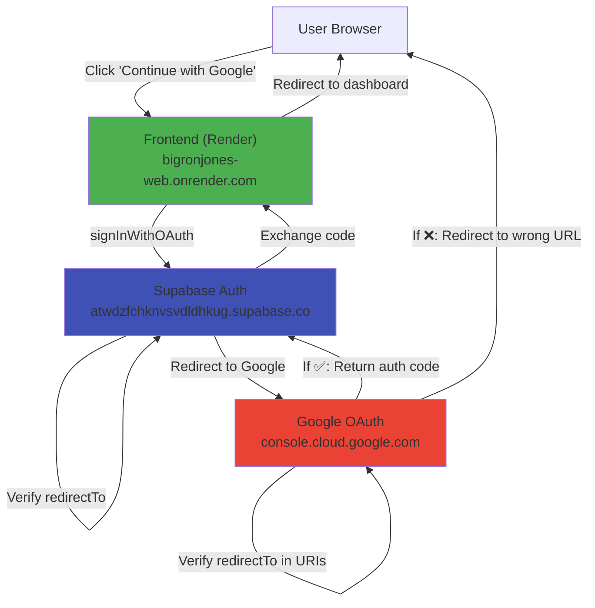

# 🚨 OAuth Redirect Fix — Render Deployment

## Problem

After deploying frontend to Render, clicking "Continue with Google" redirects to old deleted Vercel deployment:

```
https://bigronjones-deploy-741x.vercel.app/
→ 404: DEPLOYMENT_NOT_FOUND
```

## Root Cause

The OAuth redirect URL sent to Google doesn't match the URLs registered in:

1. ❌ Supabase: Authentication → URL Configuration
2. ❌ Google Cloud: OAuth 2.0 Client ID → Authorized redirect URIs

Google & Supabase still have the **old Vercel domain** registered.

## The Fix: 3 Steps

### Step 1: Set VITE_SITE_URL on Render

1. Go to [Render Dashboard](https://dashboard.render.com)
2. Open **bigronjones-web** (Static Site)
3. Click **Environment** tab
4. Find or create: `VITE_SITE_URL`
5. Set value: `https://bigronjones-web.onrender.com`
6. Click **Save** → Render rebuilds automatically

Wait 1-2 minutes for rebuild.

### Step 2: Update Supabase URL Configuration

1. Go to [Supabase Dashboard](https://supabase.com/dashboard)
2. Click your project: **atwdzfchknvsvdldhkug**
3. Left sidebar → **Authentication** → **URL Configuration**
4. Under **Redirect URLs**, add:
   ```
   https://bigronjones-web.onrender.com/auth/callback
   ```
5. Click **Save**

✅ Keep existing URLs if using multiple domains (localhost, custom domain, etc.)

### Step 3: Update Google OAuth Authorized Redirect URIs

1. Go to [Google Cloud Console](https://console.cloud.google.com/)
2. Select project: **bigronjones-oauth**
3. Left sidebar → **APIs & Services** → **Credentials**
4. Click the OAuth 2.0 Client ID: **Big Ron Jones Web**
5. Under **Authorized redirect URIs**, add:
   ```
   https://bigronjones-web.onrender.com/auth/callback
   ```
6. Click **Save**

✅ Keep existing URIs:

- `http://localhost:3000/auth/callback` (local dev)
- `https://atwdzfchknvsvdldhkug.supabase.co/auth/v1/callback?provider=google` (Supabase)

---

## Verify the Fix

1. Open browser → https://bigronjones-web.onrender.com
2. Click **Sign In** → **Continue with Google**
3. Sign in with your Google account
4. Check browser console (F12) for log:
   ```javascript
   [useAuth] Google OAuth - Verifying redirect configuration: {
     VITE_SITE_URL: "https://bigronjones-web.onrender.com",
     detected_origin: "https://bigronjones-web.onrender.com",
     redirectTo: "https://bigronjones-web.onrender.com/auth/callback",
     ...
   }
   ```
5. ✅ Should redirect to `/auth/callback` then dashboard
6. ❌ If still seeing old Vercel URL: check browser cache (Ctrl+Shift+Delete) and try incognito mode

---

## How It Works

```
User at https://bigronjones-web.onrender.com clicks "Continue with Google"
                            ↓
Frontend calls signInWithGoogle()
                            ↓
siteOrigin() returns:
  1. VITE_SITE_URL env var (if set)
  2. window.location.origin (fallback)
                            ↓
redirectTo = "https://bigronjones-web.onrender.com/auth/callback"
                            ↓
Supabase.signInWithOAuth sends this URL to Google
                            ↓
Google checks: is this URL in "Authorized redirect URIs"?
  YES → Returns OAuth code to this URL ✅
  NO → Blocks & redirects to hardcoded old URL ❌
                            ↓
Browser receives auth code at /auth/callback
                            ↓
AuthCallback.tsx exchanges code for session
                            ↓
User is redirected to dashboard ✅
```

---

## For Custom Domain (Future)

If you add a custom domain (e.g., `www.bigronjones.com`):

1. Update Render:

   ```
   VITE_SITE_URL=https://www.bigronjones.com
   ```

2. Update Supabase URL Configuration:

   ```
   https://www.bigronjones.com/auth/callback
   ```

3. Update Google OAuth URIs:
   ```
   https://www.bigronjones.com/auth/callback
   ```

The code automatically uses `window.location.origin`, so it will work on any domain!

---

## Debugging Commands

If OAuth still fails after all 3 steps:

```javascript
// In browser console (F12)

// Check what siteOrigin() returns
import { useAuth } from "@/hooks/useAuth";
// (You can't directly call siteOrigin from console, but the console.log shows it)

// Check environment variables
console.log(import.meta.env.VITE_SITE_URL);
console.log(import.meta.env.VITE_SUPABASE_URL);

// Check Google configuration
// https://console.cloud.google.com → Credentials → OAuth 2.0 Client ID
// Copy "Client ID" and verify it matches Supabase
```

---

## Timeline

| Step                          | Time        | Status                 |
| ----------------------------- | ----------- | ---------------------- |
| 1. Render `VITE_SITE_URL`     | Immediate   | ⏳ Rebuilds in 1-2 min |
| 2. Supabase URL Configuration | Immediate   | ✅ Live instantly      |
| 3. Google OAuth URIs          | Immediate   | ✅ Live instantly      |
| Test OAuth                    | After all 3 | Should work!           |

---

## If Still Broken

1. Hard refresh browser: `Ctrl+Shift+Delete` (Windows) or `Cmd+Shift+Delete` (Mac)
2. Clear site data: DevTools → Application → Storage → Clear site data
3. Try incognito/private mode
4. Check Supabase logs: Dashboard → Logs (bottom left)
5. Check Google Cloud logs: APIs & Services → Credentials → check activity
6. Verify no typos in URLs (trailing slashes, case sensitivity, etc.)

---

## Architecture Diagram



---

## Checklist

- [ ] Render `VITE_SITE_URL=https://bigronjones-web.onrender.com`
- [ ] Supabase URL Configuration includes `https://bigronjones-web.onrender.com/auth/callback`
- [ ] Google OAuth Authorized redirect URIs includes `https://bigronjones-web.onrender.com/auth/callback`
- [ ] Browser cache cleared
- [ ] Test login successful
- [ ] Console shows correct `redirectTo` URL
- [ ] Dashboard accessible after login
